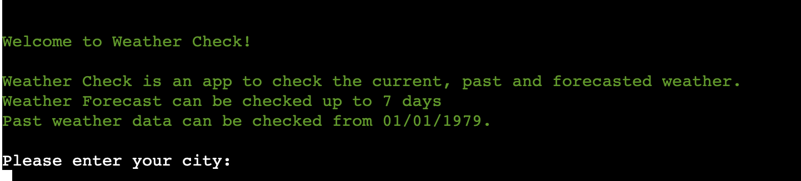
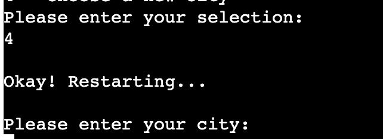

# Weather Check
Weather Check is a python app for checking current, past and weather forecast.
This project utilises the OpenWeather API for accurate weather readings from your chosen city.

[image here]

Link for the finished deployed site: [Weather Check](https://weather-check-e66ed6c3dc9b.herokuapp.com/)

# Table of Contents

* [User Experience](#user-experience)
    * [User Stories](#user-stories)
    * [Wireframes](#wireframes)
* [Features](#features)
    * [Current Features](#current-features)
    * [Future Features](#future-features)
    * [Accessibility](#accessibility)
* [Technology Used](#technology-used)
    * [Languages](#languages)
    * [Frameworks, Libraries & Programs](#frameworks-libraries--programs)
* [Deployment](#deployment)
* [Testing](#testing)
* [Credits](#credits)
    * [Code](#code)
    * [Media](#media)
    * [Acknowledgements](#acknowledgements)

# User Experience

The aim of this project is to provide the user with accurate weather information based on the user's selection of the city.
It provides information on current, past and forecasted weather.

## User Stories

* As a first time User, we want to understand immediately what information is required from us to run the app effectively.
  
* As a returning User, we want to be able to input a new city to check the weather for any location we wish to see weather information for.

## Planning

[Miro](https://miro.com/) was used for planning the project

## Colors

[Termcolor](https://pypi.org/project/termcolor/) was used to introduce colors into the terminal project to add better readability.

* Green was used for informational messages, such as the welcome message and date requirements or past weather
* Yellow was used on text confirming the date.
* Red was used on errors and weather alert warnings to promote a sense of urgency.

# Features 

## Current Features

### Welcome Message

The welcome message uses ascii art to personalise the app.
It uses a title and an umbrella ascii image.
The welcome message allows the user to understand the purpose of the app, and asks them to enter their city.
If an invalid city is added, the user is asked to enter a valid city.

### App options

The app will confirm the user's city and print the corresponding country code. 
This gives the user confirmation that the app is checking the correct city.
The app then provides four options; current weather, forecasted weather, past weather and enter a new city.
The options also give a key on how to select them.
After each selection is chosen, the user will see the options again to choose a new request or start the process with a new city.

### Current Weather

The current weather is selected by entering 1 into the options.
This provides current weather information to the user, including sunrise and sunset times based on the city's local time.

### Weather Forecast

The weather forecast is selected by entering 2 into the options.
The user is then asked to enter how many days in the future they would like to see the forecast for.
The app will then confirm the date that it is showing the forecast for.
If there is a weather alert, this will display on this page:

### Past Weather

The past weather is selected by entering 3 into the options.
The user is then asked to enter the date they would like to check the weather for.
The user can choose a date from 01/01/1979.
The date must be the format of DD/MM/YYYY, if the user enters an incorrect format or date and error will be shown.

### New City

A new city can be checked by entering 4 into the options.
The app will confirm that the service is restarting and they are asked to enter a new city to run through the app.

## Future Features

* When my skills have furthered it would be nice to be able to enter different date patterns into the past_weather function, such as 01.01.01 to give users more flexibility.
* It would be nice in future to store the weather data and city, and allow the user to map out a journey from City A to City B and check if there are any potential weather warnings or alerts to consider.
* Higher tier plans on the OpenWeather API allow for calls to check the road risk. It could be nice in future to include this to allow the user to check their safety in a given location.

# Technology Used

## Languages

* Python

## Frameworks, Libraries & Programs 

* [CodeAnywhere](https://codeanywhere.com/) was used to write code, commit and push to GitHub.
* [GitHub](https://github.com/) was used to store the project code after pushing.
* [Heroku](https://www.heroku.com/) was used to deploy the site.
* [OS](https://docs.python.org/3/library/os.html) was used for importing the OpenWeather API key via environment variables.
* [Dotenv](https://pypi.org/project/python-dotenv/) was used for importing the OpenWeather API key via environment variables.
* [Requests](https://pypi.org/project/requests/) was used to call the OpenWeather API throughout the project.
* [Datetime](https://pypi.org/project/DateTime/) was used to extract a timestamp to be used by the OpenWeather API from a date entered into the program, and to print a human-readable date from a timestamp to the user from the API.
* [Termcolor](https://pypi.org/project/termcolor/) was used to introduce color to the terminal.
* [TextWrap](https://docs.python.org/3/library/textwrap.html) was used to wrap text within the terminal, to allow for better readability by not allowing words to split up at line breaks.

# Deployment & Development

## Forking the Repository

1. Log in or Sign up to [GitHub](https://github.com/)
2. Navigate to https://github.com/saziosu/weather-check.
3. Click the 'fork' button in the top right corner.
4. Feel free to customize your repo name, this is not required.
5. Click the Create Fork button.

## Deploy to Heroku
Heroku was used to deploy this site:

1. Login (or signup) to Heroku with GitHub
2. Navigate to the [apps page](https://dashboard.heroku.com/apps)
3. Click the 'new' button in the top right corner and create new app.
4. Choose an app name and select your region.
4. Navigate to the settings page for the app.
5. Under Buildpacks add NodeJS and Python
6. Reveal config vars and add your API key credentials
7. Navigate to the deploys section of the app.
8. Select deploy with github and connect the appropriate repo.
9. Click deploy, or select automatic deployment.

# Testing

[TESTING.md](TESTING.md)

# Credits

## Code

* [NeuralNine](https://www.youtube.com/watch?v=9P5MY_2i7K8), I used this tutorial to help me with starting up and utilising the OpenWeather API.
* [NeuralNine](https://www.youtube.com/watch?v=8dlQ_nDE7dQ), I used this tutorial to help with loading environment variables.
* [GeeksForGeeks](https://www.geeksforgeeks.org/convert-date-string-to-timestamp-in-python/), I used this resource to help convert date strings into timestamps to use in the API calls
* [GeeksForGeeks](https://www.geeksforgeeks.org/how-to-convert-timestamp-string-to-datetime-object-in-python/), I used this resource to help convert timestamps to dates and times to be printed to the user.
* [GeeksForGeeks](https://www.geeksforgeeks.org/textwrap-text-wrapping-filling-python/), I used this resource to help implement the textwrap feature on weather alerts in the forecasted weather option.
* [Programiz](https://www.programiz.com/python-programming/datetime/timestamp-datetime), also used this resource to help convert dates into timestamps.
* [StackOverflow](https://stackoverflow.com/questions/69757549/how-do-i-make-a-function-execute-when-a-certain-key-is-pressed), used this resource to help the user select which function they want to run.
* [Eyehunts](https://tutorial.eyehunts.com/python/python-import-variable-from-another-file-example-code/), used this resource to help display the ascii art variables from the displays.py file.

## Media

* [Ascii Art Archive](https://www.asciiart.eu/), the ascii art used in the welcome message was sourced from this archive.

# Acknowledgements

* Marcel, mentor, for all the help and advice throughout the project.
* Course Facilitator Alan for all the helpful tips and tricks, and great guidance throughout the project.
* My cohort classmates for feedback during our standups.