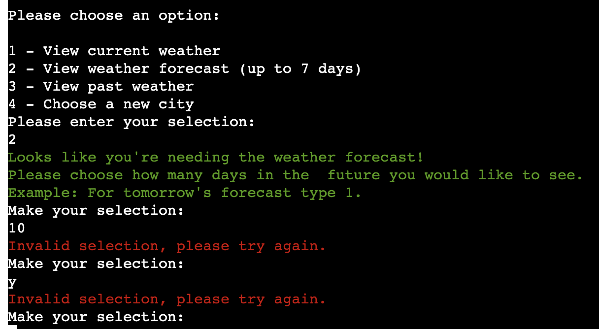

# Weather Check | Testing

Weather Check is a python app for checking current, past and weather forecast.
This project utilises the OpenWeather API for accurate weather readings from your chosen city.

Link for the finished deployed site: [Weather Check](https://weather-check-e66ed6c3dc9b.herokuapp.com/)

# Table of Contents

* [Automated Testing](#automated-testing)
* [Manual Testing](#manual-testing)
    * [User Testing](#user-testing)
    * [Full Testing](#full-testing)
* [Bugs](#bugs)
    * [Known Bugs](#known-bugs)
    * [Fixed Bugs](#fixed-bugs)

# Automated Testing

[CI Python Linter](https://pep8ci.herokuapp.com/) was used to test the python code.

Initially the result was the following:

Updated the code to resolve these errors and it passed through the linter with no further errors found:

# Manual Testing

## User Testing

| **Goal**                                                                                                       | **Achieved**                                                                                                                                                                       |
|----------------------------------------------------------------------------------------------------------------|------------------------------------------------------------------------------------------------------------------------------------------------------------------------------------|
| As a user, I want to immediately understand what the purpose of the program is and easily navigate through it. | A welcome message displays on the initial run of the program, which explains the purpose of the program and the data it can provide, such as current, past and forecasted weather. |
| As a user, I want to receive clear feedback from my interactions with the program.                             | When the user inputs their data, the program gives feedback to the user confirming their choice or providing an error if the input is invalid.                                     |
| As a user, I want to be given the opportunity to correct my input if an error occurs.                          | If an error occurs on user input, the user is asked to try again and provided with the input again.                                                                                |
| As a user, I want to be able to navigate all options of the app without having to re-run the program.          | After each option is run, e.g. the current weather, all options are displayed again so that the user can see the other data for their selected city.                               |
| As a user, I want to be able to enter a new city into the program to check the a different location easily.    | After each option is run, the user has the option to enter a new city into the program to check the data for a different area.                                                     |

## Full Testing

| **Feature**      | **Outcome**                           | **Example**          | **Pass/Fail** |
|------------------|---------------------------------------|----------------------|---------------|
| Welcome Message  | Validate user input                   |    | Pass          |
| Welcome Message  | Confirm Country code to user          |      | Pass          |
| Navgation        | Validate user input                   |     | Pass          |
| Navigation       | Show navigation after each selection  |             | Pass          |
| Current Weather  | Output weather data from API          |       | Pass          |
| Weather Forecast | Validate user input                   |      | Pass          |
| Weather Forecast | Confirm date selected to user         |        | Pass          |
| Past Weather     | Validate User Input                   |  | Pass          |
| New City         | Allow user to enter new city          |              | Pass          |

# Bugs

## Known Bugs

KNOWN BUGS TABLE

## Fixed bugs

FIXED BUGS TABLE

[Top](#weather-check--testing)